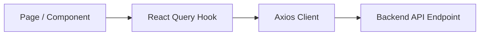

# Helping Mitra - Phase 0 Frontend Foundation

Welcome to the **Helping Mitra** frontend client codebase. This client app is built using **Next.js (App Router)**, **TypeScript**, **Tailwind CSS v4**, **Axios**, and **TanStack Query (React Query v5)**.

It provides a live operational dashboard displaying health stats, backend status, database checks, and future architectural roadmaps.

---

## 📁 Folder Structure

```text
frontend/
├── app/
│   ├── layout.tsx            # Global layout hosting the ReactQueryProvider
│   ├── page.tsx              # Interactive dashboard homepage querying health APIs
│   └── globals.css           # Tailwind v4 directives and theme variables
├── components/               # Shareable component library
│   ├── common/
│   ├── layout/
│   └── ui/
├── features/                 # Domain-driven features
│   └── health/               # Health Telemetry module
│       ├── health.api.ts     # Axios fetch functions
│       └── health.hooks.ts   # TanStack Query React hooks
├── lib/                      # Infrastructure integrations
│   ├── axios.ts              # Custom centralized Axios client with interceptors
│   └── queryClient.ts        # TanStack Query config client
├── providers/                # Client context wrappers
│   └── ReactQueryProvider.tsx # Provider wrapping components and embedding devtools
├── types/
│   └── index.ts              # Shared TypeScript declarations
├── .env.example              # Variables guide
├── package.json              # Client dependencies
└── README.md                 # HANDBOOK
```

---

## 🏗️ Architecture Design Rules

To maintain cleanliness and modularity as features are added, code flows must strictly adhere to the following pipeline direction:



1. **Page/UI Component**: Renders visual indicators and binds interactivity. Only imports hooks to fetch data or trigger mutations.
2. **React Query Hook**: Configures query keys, stale times, polling intervals, caching, and mutation state maps.
3. **Axios Client**: Encapsulates raw HTTP methods, request headers, timeouts, and error handling.
4. **Backend API**: The endpoint resolver handling database operations and formatting JSON.

---

## 🚀 Setup & Execution

### 1. Installation
Enter the `frontend/` directory and install the package dependencies:
```bash
cd frontend
npm install
```

### 2. Configure Environment
Create a local `.env` file from the example template:
```bash
cp .env.example .env
```
Ensure `NEXT_PUBLIC_API_BASE_URL` points to your backend instance (e.g. `http://localhost:5050/api` or `http://localhost:5000/api`).

### 3. Run Development Server
Spins up a Next.js development server:
```bash
npm run dev
```
Open [http://localhost:3000](http://localhost:3000) to view the live dashboard.

### 4. Build for Production
Pre-compiles Next.js routes and validates types:
```bash
npm run build
```
Build files are compiled into `.next/` ready to be deployed.
